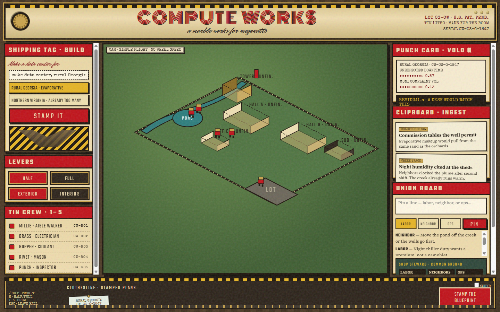
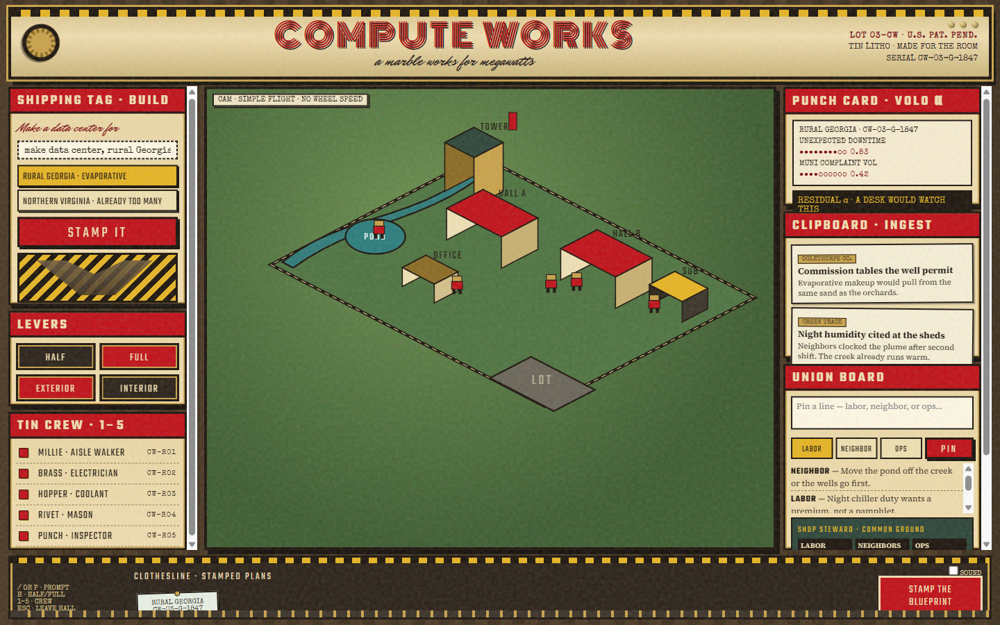
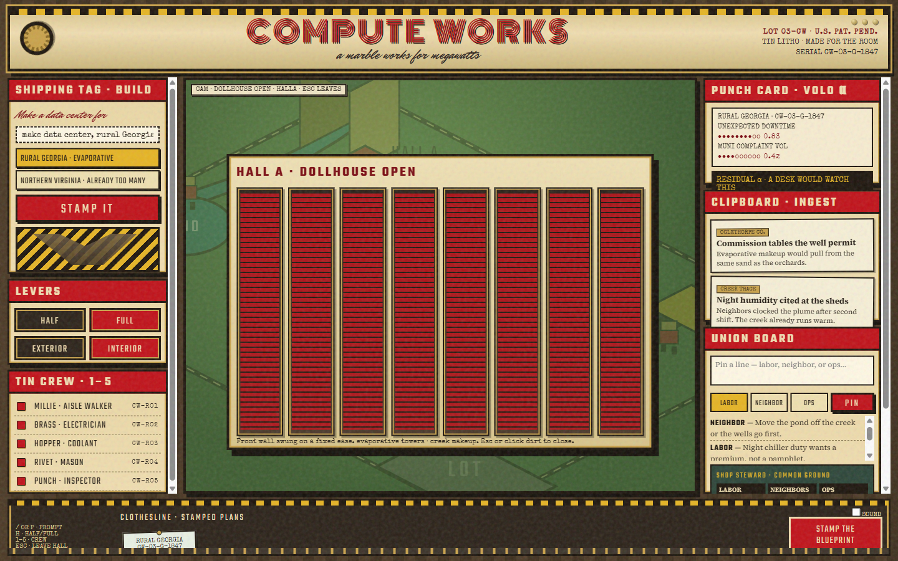

# COMPUTE WORKS Design
**19 September 2026 · chosen prototype · Democratising Data Centres**

COMPUTE WORKS is a tin-lithograph playset that builds a data center from a shipping tag, then maintains it with enamel robots on a metadata graph. Neighbors argue with a factory they can open. A permitting desk reads one residual, α, on a punch-card.

This document records the look and the interaction as they stand at `http://127.0.0.1:8763/?v=2`. Requirements live in [PRD.md](PRD.md). The playable file is [index.html](index.html).

---

## Why this object

A data center is a factory: halls, a cooling plant, a substation, a parking lot, and a creek the halls can sit on. People have held that toy.

Construction is a marble run. Maintenance is a trek. Failure and civic cost share one object, the punch-card. α is unexpected downtime minus complaint-implied downtime. A trader and a shop steward can read the same tin.

---

## Screens

### 1. Half-built campus (shipping state)

The plant arrives unfinished. Roofs are off. Racks show. The cooling intake ships with a flag. First frame is a pour.



### 2. Full campus (lithograph complete)

`FULL` stamps roofs on. Halls read as enamel boxes on a green lot. The creek still cuts the diamond. Robots keep their routes. Same graph, different political object.



### 3. Interior (dollhouse open)

Click a hall or throw `INTERIOR`. The front wall swings on a fixed ease. You get racks, a caption, and no drone. Wheel does nothing to camera speed. `Esc` or dirt closes it.



---

## Layout

A factory chassis, three columns, one footer.

| Zone | Contents |
|---|---|
| **Sign** | `COMPUTE WORKS` in Monoton. Gears. Lot plate: `LOT 03-CW`, serial `CW-03-G-1847`. |
| **Left** | Shipping tag (prompt + two place presets + `STAMP IT`). Danger-stripe chute. HALF / FULL / EXTERIOR / INTERIOR. Tin crew `1`–`5`. |
| **Stage** | Isometric green lot inside a brass-rimmed plate. Creek, pond, halls, office, tower, substation, parking. Cam label: simple flight, no wheel speed. |
| **Right** | Punch-card α. Clipboard of clippings for *this* site. Union noticeboard. Shop steward summary. |
| **Footer** | Keyboard legend. Clothesline of stamped plans. `STAMP THE BLUEPRINT`. |

The campus *is* the map. Pond against creek is the geoloc. You do not open a second view to find the well.

---

## Color

Commit to enamel and cream. Keep purple and glass out.

| Token | Hex | Use |
|---|---|---|
| Enamel | `#c01018` | Sign, stamp buttons, hall roofs, rack faces |
| Enamel deep | `#7a0a10` | Pressed metal, script labels |
| Cream | `#f0ddb0` | Panel faces, punch-card stock |
| Brass | `#c9a24a` | Rims, selected trek, gears |
| Ink | `#1c140c` | Rules, type, die-cut edge |
| Oxide | `#2c4538` | Lot grass |
| Danger yellow | `#e6b423` | Hazard stripe, HALF scaffold |

Background behind the chassis is stained wood (`#3a2c1c` with a 18px plank repeat). A grain overlay sits at 14% and ignores pointer events.

---

## Type

| Face | Job |
|---|---|
| **Monoton** | Works sign only |
| **Teko** | Levers, crew names, chrome |
| **Mr Dafoe** | Shipping-tag script |
| **Special Elite** | Punch-cards, serials, cam plate |
| **Source Serif 4** | Clipboard and steward copy |

Do not add Inter, Roboto, Arial, Space Grotesk, or system-ui.

---

## Motion

- Gears on the sign spin (8s / 11s reverse).
- `STAMP IT` drops a marble down the chute in steps.
- Robots walk on a ~160ms snap. They do not ease like characters.
- Hall flight is one curve: `transform 0.85s cubic-bezier(0.22, 1, 0.36, 1)`.
- WebAudio beeps exist and stay muted until someone unmutes.

If a projector flattens the isometric shear, the interior cutaway still reads. That cutaway is the fallback.

---

## Interaction contract

1. Type or pick a place. Stamp. The campus constructs (Georgia ships water-red; Northern Virginia ships transformer-red).
2. `H` toggles half and full.
3. Click a hall. The dollhouse opens. `Esc` leaves.
4. Keys `1`–`5` select a robot. The trek lights. The work order is a ticket.
5. Hover the red part. The punch-card names days-to-fail and the civic cost (wells, night noise, the feeder).
6. Pin a line on the noticeboard. The steward writes the sentence the three benches share.
7. Drag the pond off the creek or the substation off the lot. α re-punches. Stamp the blueprint onto the clothesline (this browser’s `localStorage`).

Keyboard: `/` or `P` focuses the tag, `H` half/full, `1`–`5` crew, `Esc` leaves the hall.

---

## The punch-card

α is the only number on the right that has to move.

```
unexpected downtime   (red/amber materials + trek delay)
− complaint-implied   (clippings + pins + pond/creek adjacency)
= α                   (basis points of residual risk)
```

Drag the pond off the creek and water days-to-fail improve; α thins. Fill the board with night-noise pins and complaint-implied rises; α compresses. Leave the transformer red with robots detouring and α stays fat.

If α sits still while the toy moves, the Voloridge pull failed.

---

## Civic layer (thin on purpose)

The clipboard swaps when the shipping tag changes county. Pins on the clippings name grid and creek. The noticeboard is the forum. The steward summary stands in for Jigsaw; we do not call their API. Shared plans are clothesline sheets in one browser. Say that if a judge asks.

---

## Keep

- The three-column chassis and the diamond lot.
- Half as the default first stamp.
- One red component on arrival.
- Stepped robots and a single flight curve.
- α on a punch-card.
- Two place presets. A third only if it changes the red part.

## Leave out

- Tripo, GLTF, gaussian splats, Three.js globes.
- Live LLM ingest, Jigsaw, SCADA, a real Voloridge feed.
- Scroll-wheel flight, orbit camera, adjustable zoom speed.
- A second product (newspaper, atlas, referee booth) inside this file.

---

## Judge minute

Stamp Georgia. Show the unfinished racks. Throw `FULL`. Open Hall A. Select Punch. Hover the intake. Pin one line. Drag the pond. Watch α. Swap the tag to Northern Virginia. Stop.
